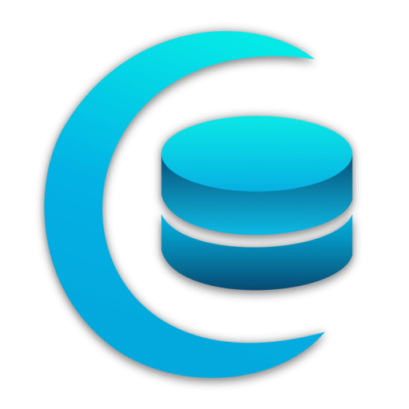
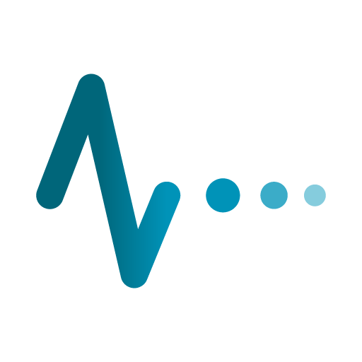
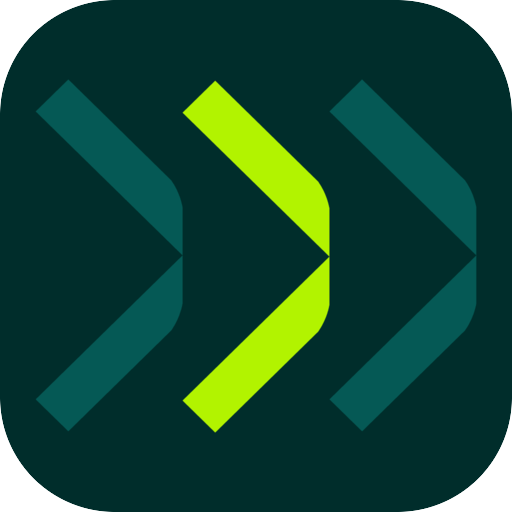
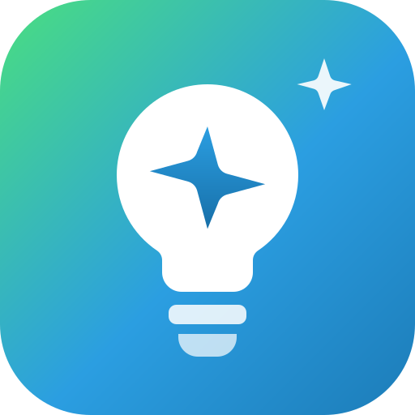
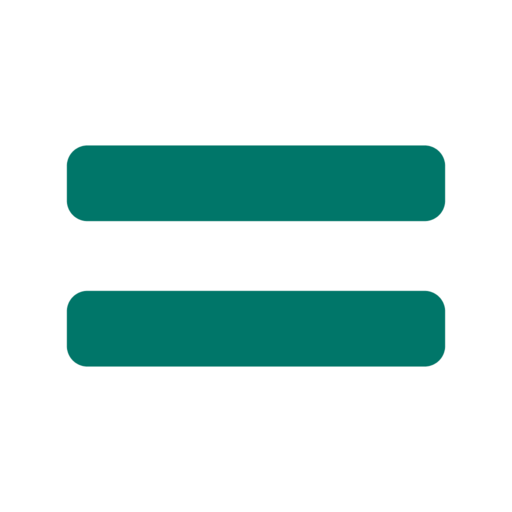
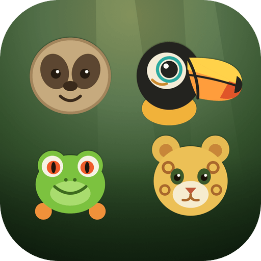
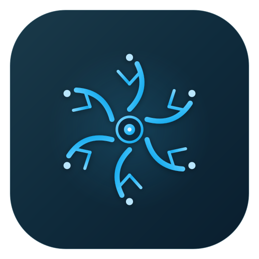

<!-- Header -->
<div align="center">
  
</div>

<!-- Typing SVG -->
<p align="center">
  <a href="https://git.io/typing-svg">
    
  </a>
</p>

<!-- Social Badges -->
<p align="center">
  <a href="https://www.idevtim.com"></a>
  <a href="https://x.com/idevtim"></a>
  <a href="https://linkedin.com/in/idevtim"></a>
  
</p>

---

### About Me

```php
<?php

class Developer extends Human
{
    public string $name = 'Timothy Murphy';
    public string $role = 'Full Stack Developer';
    public int $yearsExperience = 15;

    public array $skills = [
        'Backend'   => ['PHP', 'Laravel', 'MySQL', 'Redis', 'REST APIs'],
        'Frontend'  => ['React', 'Vue.js', 'Tailwind CSS', 'TypeScript'],
        'Desktop'   => ['Tauri', 'Electron', 'React Native'],
        'Systems'   => ['Rust'],
        'Apple'     => ['Swift', 'SwiftUI', 'iOS', 'watchOS', 'macOS'],
        'AI'        => ['OpenAI', 'Claude', 'Gemini', 'Ollama'],
        'Infra'     => ['Docker', 'AWS', 'Linux', 'Node.js'],
    ];

    public function getCurrentFocus(): string
    {
        return 'You bring the vision. I handle the code.';
    }
}
```

---

### 01. Websites

<a href="https://lunodb.app">
  
</a>

**[LunoDB](https://lunodb.app)** — The AI-powered database platform for Desktop & Mobile. Monaco-based SQL editor with IntelliSense, SSH tunneling, data visualization, and natural language queries across 8 database systems. Free forever, with a Pro upgrade for advanced features.

`90+ releases` `400+ features` `8 AI providers` `Built in 10 months`

<br/>

<a href="https://lastseenup.com">
  
</a>

**[Last Seen Up](https://lastseenup.com)** — Uptime, heartbeat, SSL and domain monitoring that double-checks every failure before it wakes you. Watches sites, ports, DNS, certificates, domain registrations and cron jobs from multiple regions, confirms a failure across regions before opening an incident, then escalates from a Time Sensitive push to a phone call until somebody acknowledges. Native iPhone, iPad and Apple Watch app with Live Activities counting the outage on the lock screen, widgets and complications — plus a web dashboard for the morning after.

`Laravel` `React` `SwiftUI` `watchOS` `Multi-Region` `APNs` `Live Activities`

<br/>

<a href="https://itsworthmore.com">
  
</a>

**[ItsWorthMore.com](https://itsworthmore.com)** — A comprehensive e-commerce platform for buying and selling used electronics with advanced pricing algorithms and real-time valuations.

`E-Commerce` `Laravel` `Real-Time Pricing`

<br/>

<a href="https://listergenius.com">
  
</a>

**[ListerGenius](https://listergenius.com)** — Intelligent listing optimization platform that helps businesses maximize their online presence and sales conversion rates.

`SaaS` `Laravel` `Listing Optimization`

---

### 02. iOS Apps

<a href="https://apps.apple.com/us/app/last-seen-up/id6797648903">
  
</a>
<a href="https://apps.apple.com/us/app/last-seen-up/id6797648903">
  
</a>

**[Last Seen Up](https://apps.apple.com/us/app/last-seen-up/id6797648903)** — The monitoring app for the person who gets woken up. Incidents arrive as Time Sensitive pushes that break through Focus, with Acknowledge and Snooze right on the notification — no unlocking, no app launch. A Live Activity counts the outage up on the lock screen and ends on the number that matters. Home and lock screen widgets, Apple Watch complications, and Siri Shortcuts for pausing a monitor or asking what the status is.

`SwiftUI` `iOS 18+` `watchOS` `Live Activities` `WidgetKit` `App Intents` `StoreKit 2`

<br/>

<a href="https://apps.apple.com/us/app/lunodb/id6756377885">
  
</a>
<a href="https://apps.apple.com/us/app/lunodb/id6756377885">
  
</a>

**[LunoDB Mobile](https://apps.apple.com/us/app/lunodb/id6756377885)** — Database management from your pocket. Browse, query, and manage MySQL, PostgreSQL, MariaDB, SQL Server, and SQLite databases from your phone or tablet. Features an AI assistant, biometric authentication, chart visualizations, and QR code scanning to import connections from the desktop app.

`React Native` `Expo` `TypeScript` `AI Assistant` `Biometric Auth` `iPad Optimized`

<br/>

<a href="https://apps.apple.com/us/app/feevio/id6759834831">
  
</a>
<a href="https://apps.apple.com/us/app/feevio/id6759834831">
  
</a>

**[Feevio](https://apps.apple.com/us/app/feevio/id6759834831)** — Financial calculator iOS & Apple Watch app with 10 purpose-built calculators for taxes, margins, fees, tips, and more. Real-time calculations, side-by-side comparisons, and built-in marketplace fee presets for eBay, Amazon, Etsy, and others.

`SwiftUI` `watchOS` `iOS 17+` `10 Calculators` `Apple Watch Companion`

---

### 03. Games

<a href="https://apps.apple.com/us/app/cage-break-rescue-run/id6786849290">
  
</a>
<a href="https://apps.apple.com/us/app/cage-break-rescue-run/id6786849290">
  
</a>

**[Cage Break: Rescue Run](https://apps.apple.com/us/app/cage-break-rescue-run/id6786849290)** — A cozy brick-breaker with an animal-rescue heart. Fire salvos of balls to free caged animals before they cross the danger line. Five hand-themed rescue worlds with 20 species, three difficulties, a persistent Sanctuary, a coin shop, 25 app icons, and optional Game Center leaderboards. Fully playable offline — no account, no ads, no analytics.

`SwiftUI` `SpriteKit` `iOS 17+` `Game Center` `StoreKit 2` `Universal`

<br/>

<a href="https://apps.apple.com/us/app/piece-of-mind-picture-puzzles/id6792975520">
  
</a>
<a href="https://apps.apple.com/us/app/piece-of-mind-picture-puzzles/id6792975520">
  
</a>

**[Piece of Mind: Picture Puzzles](https://apps.apple.com/us/app/piece-of-mind-picture-puzzles/id6792975520)** — A calm jigsaw app built around the pictures you already love. Pick a photo, crop it, choose a piece count, and settle in as it comes back together with a soft snap and a little sparkle. Play untimed with hints on hand or race a countdown, watch a replay of your solve and share it as a video, and pick up any puzzle exactly where you left it — entirely on device, no accounts, no ads, fully offline.

`SwiftUI` `SwiftData` `iOS 18+` `PhotosUI` `AVFoundation` `Offline & Private`

---

### 04. Desktop Apps

<a href="https://lunopeak.com">
  
</a>
<a href="https://lunopeak.com">
  
</a>

**[LunoPeak](https://lunopeak.com)** — Local-first dashboard for AI-assisted development. One window for every repo, every Claude Code and Codex session, and every config — with live activity, per-session token spend, budget alerts, full session replay, hygiene checks with one-click fixes, and a built-in Assistant that can query your environment using your own API keys. Native menu-bar integration, signed auto-updater, and no accounts or telemetry. macOS, Windows, and Linux from a single Rust + Tauri 2 binary.

`Rust` `Tauri 2` `React 19` `TypeScript` `Tailwind 4` `Cross-Platform`

<br/>

<a href="https://github.com/idevtim/chillmac">
  
</a>
<a href="https://github.com/idevtim/chillmac">
  
</a>

**[ChillMac](https://github.com/idevtim/chillmac)** — Free, open-source macOS menu bar app for system monitoring and fan control. Real-time CPU/GPU temperatures, per-fan speed control, memory and battery health — all from the menu bar. Supports both Apple Silicon and Intel Macs.

`Swift` `SwiftUI` `IOKit/SMC` `XPC` `Open Source`

---

### 05. Browser Extensions

<a href="https://github.com/idevtim/demarkup">
  
</a>
<a href="https://github.com/idevtim/demarkup">
  
</a>

**[DeMarkup](https://github.com/idevtim/demarkup)** — Free, open-source Chrome extension that converts any webpage into clean, well-structured Markdown with one click. Smart content extraction, three conversion modes (main content, full page, selection), and an LLM optimization mode that strips noise for AI consumption. Privacy-first — all processing happens locally.

`Chrome Extension` `Manifest V3` `Turndown.js` `Open Source`

---

### Tech Stack

<p align="center">
  
  
  
  
  
  
</p>
<p align="center">
  
  
  
  
  
  
</p>
<p align="center">
  
  
  
  
  
</p>
<p align="center">
  
  
  
  
</p>

---

### GitHub Stats

<p align="center">
  
</p>

---

<!-- Footer -->
<div align="center">
  
</div>
